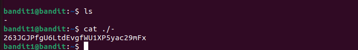

# 🏴‍☠️ Bandit Level 1 → Level 2

## 🎯 Objective
Connect to the **OverTheWire Bandit server** via SSH and retrieve the password for Level 2.

---

## 🔑 Credentials
- **Username:** bandit1  
- **Host:** bandit.labs.overthewire.org  
- **Port:** 2220  
- **Password:** (from previous level)

---

## 🔧 Steps Taken
```bash
# Connect to the server
ssh bandit1@bandit.labs.overthewire.org -p 2220

# List files
ls
# Output: -
# A file named "-" appears

# Read the file (prefix with ./ to avoid interpreting it as a command option)
cat ./-

# Output → Password for Level 2:
263JGJPfgU6LtdEvgfWU1XP5yac29mFx

## 📸 Evidence



