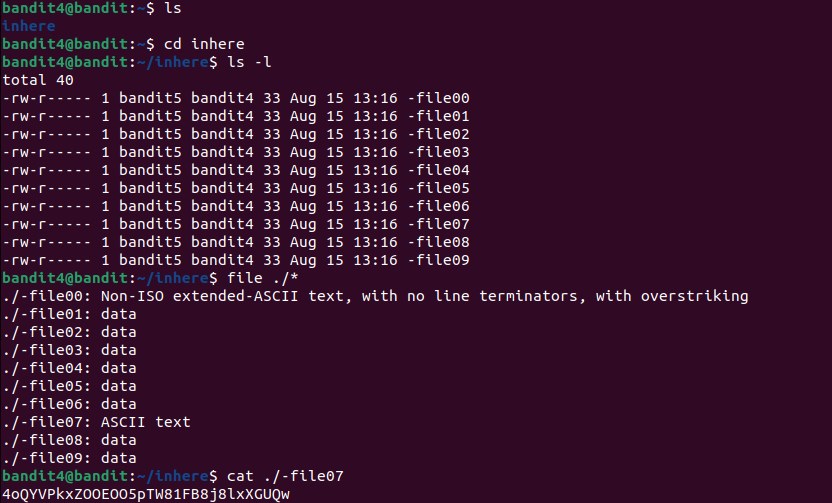

# 🏴‍☠️ Bandit Level 4 → Level 5

## 🎯 Objective
Find the password for the next level (**bandit5**).  
The password is stored in one of the files inside the `inhere` directory.

---

## 🔧 Steps Taken

1. **Connect to the server as bandit4:**
   ```bash
   ssh bandit4@bandit.labs.overthewire.org -p 2220
   Password used: (from Level 3 → 4).
2. **List the files:**
   ls
   cd inhere
   ls -l
Output shows multiple files:
-file00
-file01
...
-file09
3. **Identify the file type using file:**
   file ./*
   Output example:
   ./-file00: data
   ./-file01: data
   ...
   ./-file07: ASCII text
   ...
5. **Read the file that contains ASCII text:**
   cat ./-file07
## 📸Evidence

